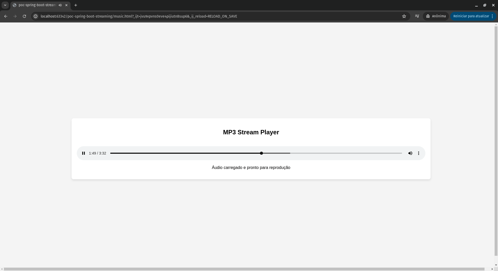

# PoC Spring Boot Streaming

Este projeto é uma prova de conceito (PoC) simples para streaming de áudio utilizando Spring Boot.



## Tecnologias Utilizadas

- Java
- Spring Boot
- Maven
- HTML

## Estrutura do Projeto

- `src/main/java/com/mumuca/pocspringbootstreaming/PocSpringBootStreamingApplication.java`: Classe principal que inicia a aplicação Spring Boot.
- `src/main/java/com/mumuca/pocspringbootstreaming/AudioController.java`: Controlador REST responsável pelo streaming de áudio.
- `src/main/resources/audios/never-gonna-give-you-up.mp3`: Arquivo de áudio utilizado para o streaming.
- `music.html`: Página HTML que consome o endpoint de streaming e reproduz o áudio.


## Endpoints

- `GET /music/stream`: Endpoint para streaming do arquivo MP3. Suporta requisições com cabeçalho `Range` para permitir o carregamento parcial do arquivo.

## Como Executar

1. Clone o repositório:
   ```shell
   git clone https://github.com/cybermumuca/poc-spring-boot-streaming.git
   cd poc-spring-boot-streaming
    ```

2. Compile e execute a aplicação:
   ```shell
   mvn spring-boot:run
   ```
   
3. Abra o arquivo `music.html` no navegador para testar o streaming de áudio.